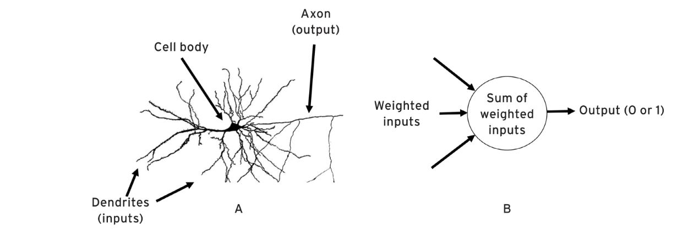
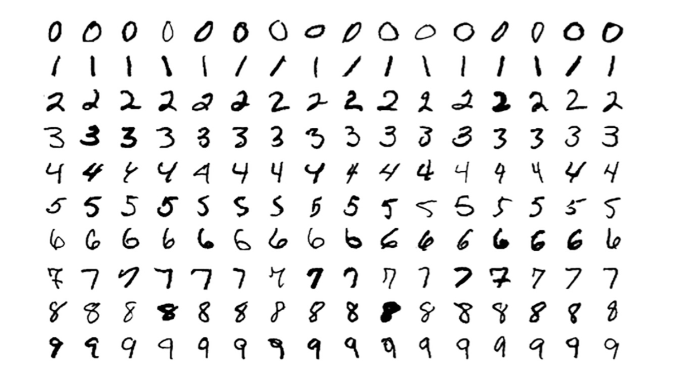
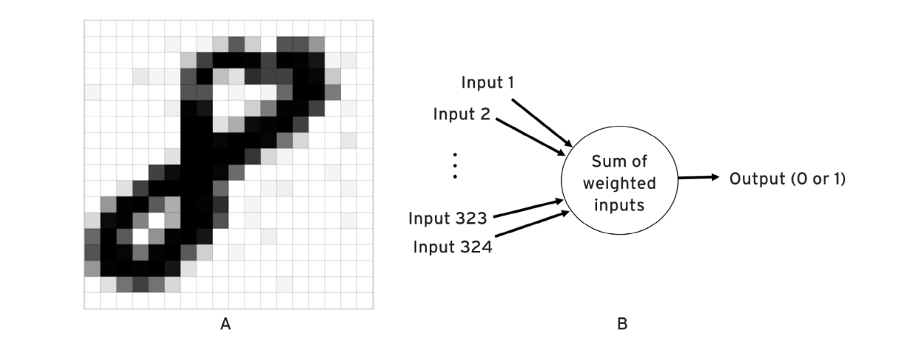
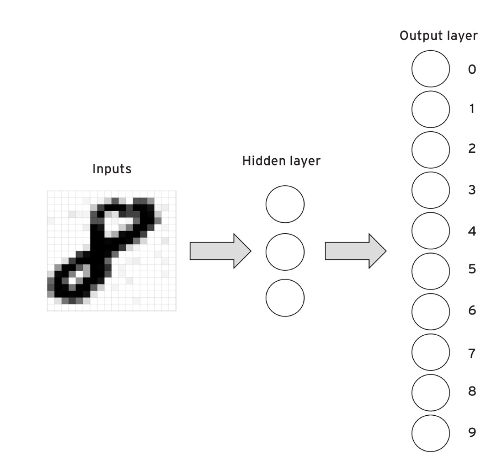
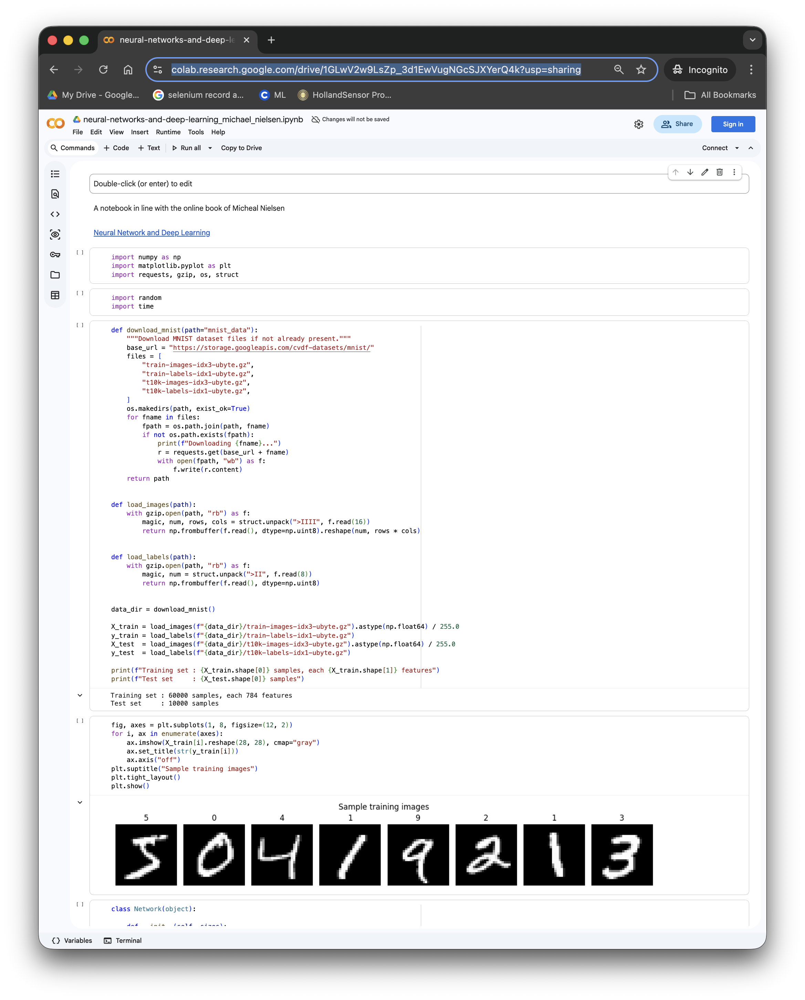

# Build Your First Neural Network

*Februari 2, 2026*

## A toy that teaches everything

The Wilesco D6 is a miniature steam engine. It has a polished nickel-plated brass boiler, an oscillating cylinder, a sight glass to check the water level, and a 70mm flywheel that spins with a satisfying hum. It fits on your desk.

It is, by any practical measure, useless. It can't power a factory or drive a locomotive. But if you want to understand the Industrial Revolution — how pressure becomes motion, how heat becomes work — you light the burner, watch the steam build, and suddenly the abstract becomes real. The principles that reshaped the world are right there, turning that little flywheel.

MNIST is the Wilesco D6 of the AI age.

It's a dataset of 70,000 handwritten digits — just tiny 28×28 pixel images of the numbers 0 through 9. It can't drive a car or write poetry. But if you want to understand how machines learn, MNIST is where you light the burner.

## From biology to code

Your brain has about 86 billion neurons. Each one receives signals through its dendrites, processes them in the cell body, and fires an output through its axon. That's it — input, process, output.

An artificial neuron does the same thing, just with math. It takes a bunch of numbers as input, multiplies each by a weight (how important is this input?), adds them up, and decides: fire or don't fire. That decision — 0 or 1 — is the output.

## The challenge: reading handwritten digits

Some digits are neat, some are messy — just like real handwriting.

Every pixel becomes a number between 0 (white) and 1 (black). A 28×28 image becomes a list of 784 numbers. That's our input — the steam entering the cylinder.

The image above is for illustrative purposes. Here it's 18x18 and becomes a list of 324 numbers.

## Connecting the dots

A single neuron can't do much — just like a single piston isn't an engine. But layers of neurons can. Our network has three parts:

1. **Input layer** — 784 neurons, one per pixel
2. **Hidden layer** — a small group of neurons that learn patterns
3. **Output layer** — 10 neurons, one for each digit (0–9)

When we feed in an image of a "8", the network processes it through these layers. If everything works, the neuron labeled "8" fires the strongest. Pressure becomes motion.

## Let's run the Steam Engine

  <iframe width="315" height="560" src="https://www.youtube.com/embed/p6tdFc0CNWg" frameborder="0" allowfullscreen></iframe>

## Let's run the Learning Neural Network
To see the code you only need browser, to run the code you need a google account. We use Google Colab. Google Colab provides an online integrated development environment (IDE) for Python that requires no setup and runs entirely in the cloud. It offers free access to computing resources, including GPUs and TPUs, making it popular among researchers and students working on deep learning and data science projects.

In addition, you can ask Google Colab, via integrated Gemini, specifically for an explanation of what you are looking at.

[Michael Nielsen MNIST](http://neuralnetworksanddeeplearning.com/)

[Google Colab Michael Nielsen MNIST](https://colab.research.google.com/drive/1GLwV2w9LsZp_3d1EwVugNGcSJXYerQ4k?usp=sharing)

With a simple network of 784 input neurons, 30 hidden neurons, and 10 output neurons, trained for 30 rounds — you'll hit about **95% accuracy**. Not bad for a few dozen lines of code.

Here the same problem from a different angle

[Numpy Tutorial MNIST](https://numpy.org/numpy-tutorials/tutorial-deep-learning-on-mnist/)

[Google Colab Numpy Tutorial MNIST](https://colab.research.google.com/drive/1v5TdyysqPh_zZ0ZF6KYJV7TM9lxG6boF?usp=sharing)

## What just happened?

The network learned, entirely on its own, which pixel patterns correspond to which digits. Nobody told it that a "7" has a horizontal line at the top. It figured that out by looking at thousands of examples and adjusting its weights — a little bit at a time — until it got better.

That's the core idea behind all of modern AI. Everything else is variations on this theme: more layers, more data, more clever tricks. But the foundation? Weighted inputs, summed up, with a decision at the end. Just like a neuron.

The Wilesco D6 won't power a factory. But once you've watched that flywheel spin, you understand steam. And once you've trained a network on MNIST, you understand something about how machines learn to see. Sometimes the smallest engine teaches the biggest lesson.
