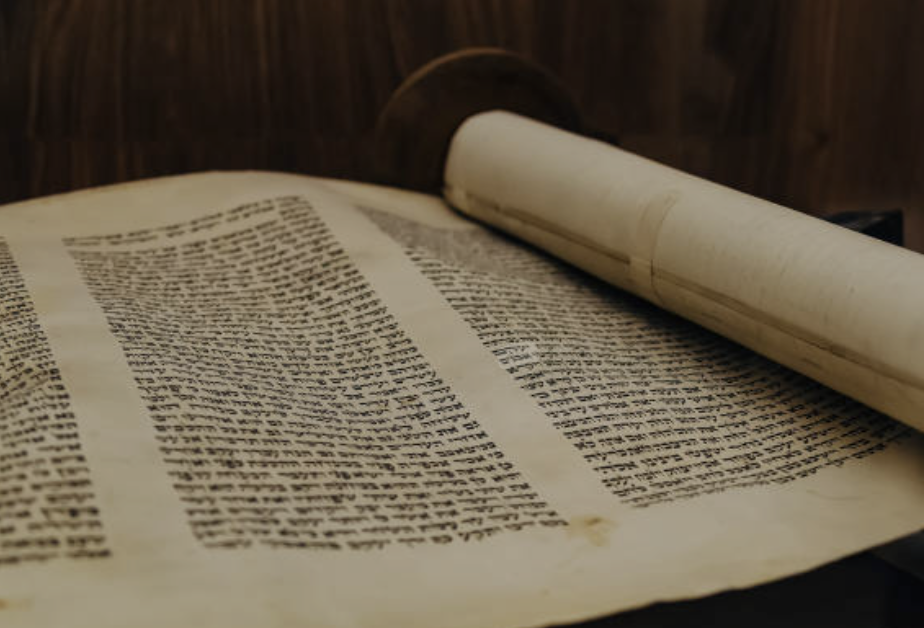
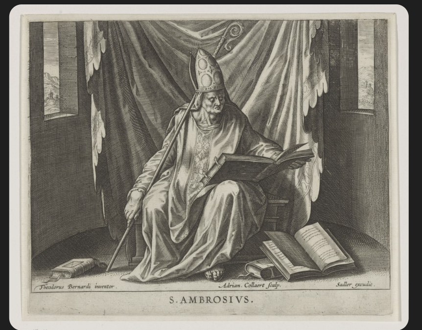
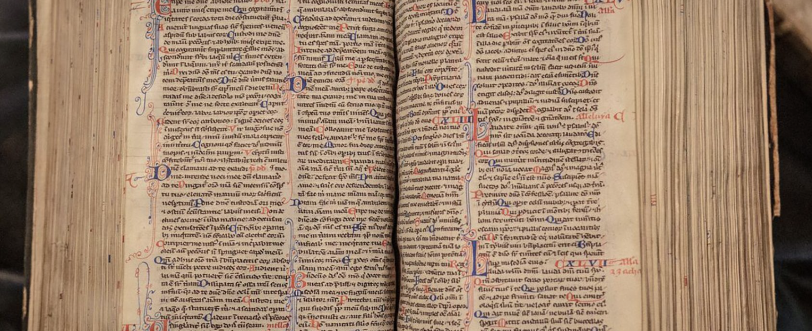
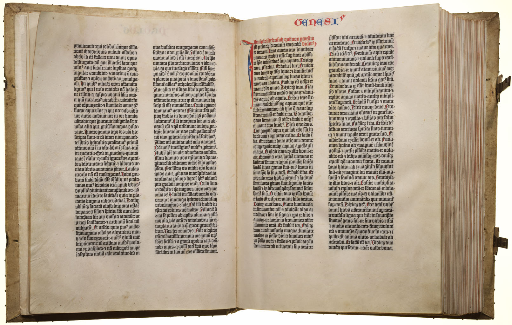

# Large Language Models en Taal

Large Language Models — LLM's in het bijzonder, en neurale netwerken in het algemeen — worden beschouwd als een kantelpunt in de menselijke geschiedenis. Maar waarom? Deze blog zal licht werpen op die vraag.

De menselijke soort onderscheidt zich duidelijk van andere soorten door twee kenmerken: uitgebreide communicatie met elkaar, en het maken van gereedschap. Het gereedschap dat zowel een aanjager als een versterker van die twee kenmerken is, is uiteraard taal.

Ik stel de volgende twee vragen:

- Kun je denken zonder taal?
- Kun je spreken of denken over een object zonder er een woord voor te hebben, of over een onderwerp spreken zonder een naam — behalve natuurlijk het woord *het*?

Taal is een heel bijzonder gereedschap, en elke verbetering van taal veroorzaakt merkbare verschuivingen in de menselijke samenleving. Naar mijn mening is de westerse beschaving, die in Griekenland begon, direct gerelateerd aan de "uitvinding" van het gebruik van klinkers in de geschreven Griekse taal. Geschreven artefacten bestaan al drie- tot vierduizend jaar. Van hiërogliefen en spijkerschrift gingen we naar een soort alfabet waarmee je woorden of woorddelen kon vormen. Bij LLM's spreken we over tokens, wat gewoon een andere naam is voor woorddelen.

## Klinkers

In Griekenland, rond achthonderd voor Christus, introduceerde iemand een nieuwe uitvinding in het alfabet: klinkers. Met de introductie van klinkers kunnen woorden op een meer uniforme manier worden gelezen en uitgesproken. Je kunt zelfs woorden lezen en uitspreken zonder te begrijpen wat je leest. Dit klinkt bekend als je bedenkt hoe een computer leest.

Laten we dit uitwerken met een paar voorbeelden. De lezer moet enigszins vertrouwd zijn met het Griekse alfabet. Vergelijk de volgende twee woorden:

- **ΟΜΑΤΑ** en **ΠOΔEΣ**

Het tweede woord is moeilijker te lezen voor de gemiddelde lezer, aangezien de letters in het eerste woord meer vertrouwd zijn en in ons huidige alfabet voorkomen. We kunnen beide woorden lezen zonder te weten wat ze betekenen.

Het weglaten van de klinkers maakt het veel moeilijker — probeer het maar met de bovenstaande woorden. De volgende veel voorkomende naam is geschreven zonder klinkers:

- **MHMD**

Je kunt gemakkelijk de naam Mohamed lezen, maar je kunt ook de volgende namen lezen:

- Mahmoud
- Mahmud
- Mohammed
- Muhammad
- Mehmed
- Mahmod
- Mohmed

Nogmaals, een naam met klinkers kan maar op één manier worden gelezen:

- **MOXAMET** kan alleen worden gelezen als MOXAMET.

De bovenstaande voorbeelden tonen de kracht van geschreven klinkers.

Natuurlijk geldt "resultaten uit het verleden bieden geen garantie voor de toekomst," maar ik geloof oprecht dat verbeteringen in taaltechnologie schaarse expertise breder beschikbaar en gemakkelijker toegankelijk maken en hiermee de mensheid democratiseert. LLM's zijn zo'n verbetering in taaltechnologie. Laten we eens kijken naar andere verbeteringen in taaltechnologie door de geschiedenis heen.

## Van Rollen naar Boeken

Hieronder zie je een boekrol. Tot aan het christendom werden belangrijke documenten op rollen geschreven.

Met het christendom werd het boek heilig. *Bijbel* betekent *boek der boeken*. Boeken, als "verbetering in taaltechnologie," verspreidden het christendom wijd en zijd. Het christendom was vanaf het begin fundamenteel een religie van teksten. In tegenstelling tot veel oude religies die voornamelijk steunden op mondelinge tradities, rituelen en priesterlijke rollen, draaide het christendom om:

**Heilige geschriften** — De Hebreeuwse Bijbel (Oude Testament) en de opkomende Nieuwtestamentische geschriften (evangeliën, brieven) gaven het christendom een draagbare, gestandaardiseerde boodschap. Iedereen die kon lezen, kon deze teksten lezen en interpreteren.

**Reproduceerbaarheid** — Teksten konden worden gekopieerd en verspreid. Een christelijke gemeenschap in Antiochië kon dezelfde brief van Paulus lezen als een gemeenschap in Korinthe, waardoor leerstellige consistentie over grote afstanden ontstond.

## Stil lezen

De heer op de afbeelding hieronder is kerkvader Ambrosius, omringd door zijn boeken.

Over het algemeen wordt kerkvader Ambrosius beschouwd als de eerste stille lezer. Ambrosius leefde in de vierde eeuw na Christus en was bisschop van Milaan. Het duurde nog elfhonderd jaar voordat stil lezen de gangbare manier van lezen werd.

## Drukken in plaats van schrijven

Vóór de boekdrukkunst waren boeken extreem duur. Het kopiëren van een boek kon jaren duren. Een monnik kon slechts een paar pagina's per dag produceren. Met de drukpers konden leken die de persen bedienden tot 2.500 pagina's per dag drukken — bijna een honderdvoudige toename in snelheid.

Zolang de drukpers niet beschikbaar was, waren boeken simpelweg te zeldzaam en te duur om altijd bij de hand te hebben, wat betekende dat je de inhoud uit je hoofd moest kennen. Alleen de docent had het boek beschikbaar tijdens colleges, en de studenten moesten de inhoud leren door te luisteren en uit het hoofd te leren.

In de tijd van Erasmus, toen het drukwerk breder beschikbaar werd, veranderde de manier van kennisoverdracht voor studenten van luisteren naar lezen. Wijdverbreid monotheïsme kwam met boeken. Het protestantisme kwam met de drukpers. De drukpers veranderde ook de formele schrijftaal van het Latijn naar de lokale moedertaal.

Zowel boeken als de drukpers maakten, als "verbeteringen in taaltechnologie," schaarse expertise breder beschikbaar en gemakkelijker toegankelijk, en democratiseerden de mensheid.

Hieronder zie je handgeschreven boekpagina's.

En hier zie je vroege gedrukte boekpagina's.

## De drukpers als oplossing gaf de Renaissance een enorme impuls

**Versterking van bestaande trends** — Ideeën die al circuleerden onder de geleerde elite konden nu sneller en breder verspreid worden. Een humanistische tekst vereiste niet langer maanden handmatig kopiëren; honderden identieke exemplaren konden snel worden geproduceerd.

**Standaardisatie** — Gedrukte boeken betekenden dat iedereen dezelfde versie van Plato of Aristoteles las, wat productievere wetenschappelijke debatten mogelijk maakte en cumulatieve kennis opbouwde.

**Bredere geletterdheid** — Naarmate boeken goedkoper en beter verkrijgbaar werden, stegen de geletterdheidscijfers voorbij de geestelijkheid en de aristocratie, waardoor het publiek voor Renaissance-ideeën groeide.

**Bewaring** — Klassieke teksten gingen minder snel verloren. Meerdere exemplaren op meerdere locaties betekenden dat kennis beter bewaard bleef.

**De connectie met de Reformatie** — De drukpers had zijn meest dramatische impact met de Protestantse Reformatie (vanaf 1517). Luthers 95 stellingen en Bijbelvertalingen in de volkstaal verspreidden zich als een lopend vuurtje dankzij de drukpers, en braken de christelijke eenheid op manieren die onmogelijk waren geweest met handgeschreven manuscripten.

## Slotwoord over LLM's

Van schrijven naar drukken naar het digitaliseren van tekst — elke keer nam de fysieke verwerkingstijd van tekst af met grote vermenigvuldigers. Met LLM's begint de *mentale* verwerkingstijd van tekst af te nemen met grote vermenigvuldigers.

Door de geschiedenis heen hebben significante verbeteringen in taaltechnologie de samenleving ingrijpend veranderd. LLM's zijn een enorme verbetering in taaltechnologie, en om die reden mag een significante maatschappelijke verandering worden verwacht.
